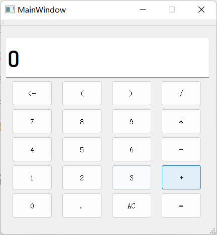

# README

Qt实现计算器，其中包括加减乘除、小数计算、括号运算、位删除、全删除等。

## 界面设计

显示窗口->QLineEdit  仅可读

计算器按键->QPushButton

布局：水平布局+网格布局

水平布局：QLineEdit+网格布局

网格布局：数字和运算符按钮

## 括号和算数优先级问题

优先级：括号>乘除>加减

利用后缀表达式解决

中缀表达式转换为后缀表达式（思路）

1. 创建栈
2. 从左向右顺序获取中缀表达式
   1. 数字直接输出
   2. 运算符
      - 情况一：遇到左括号直接入栈，遇到右括号将栈中左括号之后入栈的运算符全部弹栈输出，同时左括号出栈但是不输出。
      - 情况二：遇到乘号和除号直接入栈，直到遇到优先级比它更低的运算符，依次弹栈。
      - 情况三：遇到加号和减号，如果此时栈空，则直接入栈，否则，将栈中优先级高的运算符依次弹栈（注意：加号和减号属于同一个优先级，所以也依次弹栈）直到栈空或者遇到左括号为止，停止弹栈。（因为左括号要匹配右括号时才弹出）。
      - 情况四：获取完后，将栈中剩余的运算符号依次弹栈输出

## 后缀表达式的计算

遍历后缀表达式，遇到数字入栈，遇到符号就出栈两个数字，进行相应的计算后结果继续入栈

注意：入栈的顺序和出栈的顺序相反，再进行不满足交换律的运算（减法/除法）中进行区分